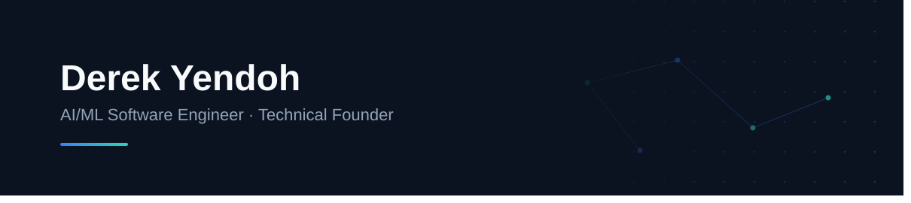

  

 

### About

I build production AI systems — MCP servers, FastAPI inference APIs, and RL-based recommendation engines at **4th IR**. Beyond that, I'm the technical founder behind two ventures: **RACA Health**, an AI-powered remote monitoring platform for high-risk patients (Mastercard Africa Health Collaborative grant winner), and **Edge AI**, a curriculum-aligned AI tutoring platform for secondary students.

### Currently

Actively building and growing RACA Health and Edge AI  

### Tech Stack

  
    
  <i><b>AI/ML:</b> RAG pipelines · RL recommendation systems · LLM inference (Anthropic, Gemini) · MCP servers · ONNX · MLflow</i>

 

### Featured Projects

**[Cascade](https://github.com/Yendoh-Derek/Cascade)** — Open-source low-latency voice AI tutor pipeline. Rebuilt latency instrumentation to fix an inflated STT timing bug and resolved an EdgeTTS buffering issue that was silently defeating audio streaming.

**[DiaTrack](https://github.com/Yendoh-Derek/DiaTrack-Web-App)** — Clinical decision support tool for diabetes risk and management, built on a cardiometabolic risk prediction system.

### Community engagements

- **Google Developer Group Accra**
- **Ghana NLP** open-source projects

---

[LinkedIn](https://www.linkedin.com/in/derek-yendoh-4a6174275) · [Twitter](https://x.com/yendohderek) · [Email](mailto:yendohderek@gmail.com)

Accra, Ghana

