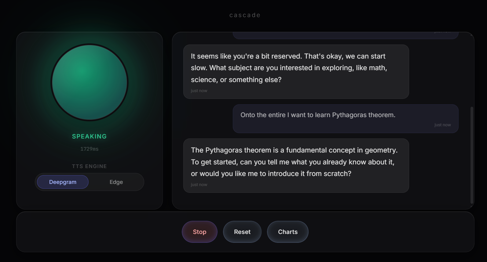

  
  
    
  
  <blockquote>
    <b>Designing AI systems for healthcare, education, and emerging digital infrastructure.</b>
  </blockquote>

  

    <!-- Primary -->
    
    &nbsp;&nbsp;
    <!-- Secondary -->
    
    &nbsp;&nbsp;
    
  

 

### 🚀 About Me

I'm an AI/ML engineer and early-stage entrepreneur focused on practical AI systems that work within real constraints. I build production AI systems — from MCP servers and FastAPI inference APIs to RL-based recommendation engines at **4th IR**. 

Beyond engineering, I'm the technical founder behind two ventures applying AI to solve critical challenges in Ghana.

### 🛠️ Tech Stack & Tools

   
   
   
  <i><b>AI & ML:</b> RAG pipelines, RL recommendation systems, LLM inference (Anthropic, Gemini), MCP servers, ONNX, MLflow</i>

 

### 🌟 Selected Projects

<table width="100%">
  <tr>
    <td align="center">
      <h3>Cascade</h3>
      
        
      
Open-source low-latency voice AI tutor pipeline. Rebuilt latency instrumentation to fix inflated STT timing and resolved EdgeTTS buffering issues for seamless audio streaming.

    </td>
  </tr>
</table>
 

---

  
<i>"I build for real constraints, not ideal assumptions."</i>

